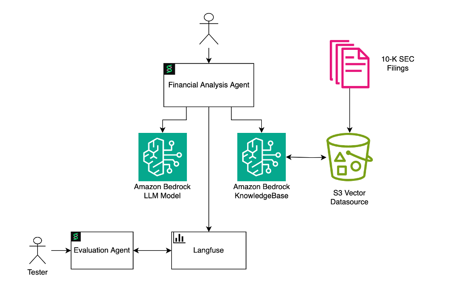

# Amazon Bedrock Langfuse Evaluation

This project demonstrates how to build, deploy, and evaluate a financial analysis AI agent using Amazon Bedrock, AWS Strands, and Langfuse for observability and evaluation.

## Architecture



The architecture consists of three main components:

1. **Knowledge Base Setup**: SEC 10-K documents are processed and stored in Amazon S3, then indexed using Amazon Bedrock Knowledge Base with vector embeddings
2. **Agent Evaluation**: A Strands-based financial analysis agent queries the knowledge base and generates responses to financial questions
3. **Observability & Scoring**: Langfuse captures traces and enables LLM-as-a-judge evaluation of agent performance

## Project Structure

```
├── 01_Setup_S3_Vector_KnowledgeBase.ipynb  # Knowledge base creation and data ingestion
├── 02_Evaluations_using_Strands.ipynb     # Agent evaluation with Langfuse integration
├── utils.py                               # Utility functions for SEC data processing
├── test_cases.json                        # Evaluation test cases with expected answers
├── preloaded_10k/                         # Pre-downloaded 10-K documents
├── send_to_langfuse.py                    # Script to send evaluation results to Langfuse
├── notebook_integration.py                # Langfuse integration code for notebooks
└── evaluation_arch.png                   # Architecture diagram
```

## Getting Started

### Prerequisites

- AWS Account with Bedrock access
- SEC API key from [sec-api.io](https://sec-api.io/)
- Langfuse account and API keys

### Setup

1. **Install dependencies**:
   ```bash
   pip install -r requirements.txt
   ```

2. **Set environment variables**:
   ```bash
   export SEC_API_KEY="your_sec_api_key"
   export LANGFUSE_SECRET_KEY="your_langfuse_secret_key"
   export LANGFUSE_PUBLIC_KEY="your_langfuse_public_key"
   ```

3. **Run the notebooks in order**:
   - `01_Setup_S3_Vector_KnowledgeBase.ipynb` - Creates knowledge base and ingests 10-K documents
   - `02_Evaluations_using_Strands.ipynb` - Evaluates agent performance with Langfuse

## Key Features

### Knowledge Base Creation
- Downloads SEC 10-K filings for multiple companies (2020-2024)
- Creates Amazon S3 vector store for document embeddings
- Sets up Bedrock Knowledge Base with automatic chunking and indexing

### Agent Evaluation
- Financial analysis agent built with AWS Strands
- Evaluates responses against human-curated test cases
- Uses LLM-as-a-judge for automated scoring
- Integrates with Langfuse for trace collection and analysis

### Observability
- OpenTelemetry integration for distributed tracing
- Langfuse dashboard for trace visualization
- Automated evaluation scoring and feedback loops

## Usage

### Custom Evaluation

Modify `test_cases.json` to add your own evaluation scenarios:

```json
{
  "questions": [
    {
      "query": "Your financial question here",
      "expected_answer": "Expected response for evaluation"
    }
  ]
}
```

## Evaluation Metrics

The system evaluates agent responses on:
- **Accuracy**: Factual correctness of financial data
- **Relevance**: Alignment with the specific question asked
- **Completeness**: Coverage of all relevant aspects
- **Tool Usage**: Effective use of knowledge base search

## Monitoring and Analysis

View evaluation results in Langfuse to:
- Track agent performance over time
- Identify common failure patterns
- Optimize prompts and retrieval strategies
- Monitor cost and latency metrics

## Cleanup

Run the cleanup sections in both notebooks to remove AWS resources and avoid ongoing charges.

## Contributing

This project is part of the AWS GenAI Quickstart POCs. For issues or improvements, please refer to the main repository.
